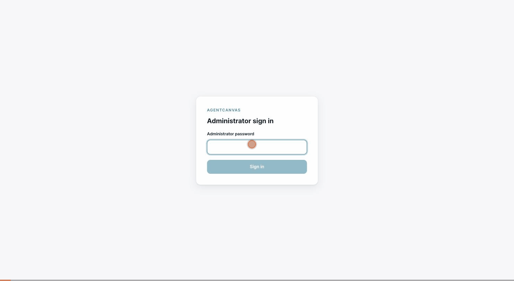

# AgentCanvas

[English](README.md) | **한국어**

AgentCanvas는 자연어와 비주얼 캔버스로 AI 에이전트를 설계하고, 실행을 관찰하며, 반복 평가할 수 있는 셀프호스트 도구입니다. 캔버스의 그래프는 실행 계약인 `AgentSpec`으로 저장됩니다.



> 위 데모: 관리자 로그인 → 자연어 요청("고객 문의 이메일을 읽고 정중한 한국어 답장을 써 줘") → AI 설계 도우미가 초안 생성(계약·흐름·가짜 실행 검토) → 캔버스에 적용 → 노드 설정 → 실제 provider로 실행하고 이벤트 타임라인 관찰.

> **Alpha software:** 현재 소스 metadata는 `v0.1.0-alpha.1`을 대상으로 합니다. 단일 신뢰 관리자와 하나의 암묵적 workspace를 위한 평가용 릴리스이며 production-ready 또는 multi-tenant 서비스가 아닙니다. 버전 정책과 변경 범위는 [`CHANGELOG.md`](CHANGELOG.md)를 참고하세요.

## 현재 제공하는 기능

- **Build:** 노드·edge 편집, schema/graph 검증, inspector, undo/redo, Impact Preview, 파일 및 서버 저장, revision history
- **Guided:** 빈 캔버스에서 자연어 요구를 제한된 `agent.patch/v1` 후보로 만들고 schema·graph·dry-run 검토 후 사용자가 승인할 때만 적용
- **Run:** routed execution, SSE event stream과 재연결, human approval gate, 취소, timeline/history, 두 실행의 정적 비교
- **Evaluate:** dataset/case 관리, 반복 실행과 필요한 통과 횟수, batch history/detail/comparison, 결정론적 `expected_phrases` 판정
- **Persistence:** SQLite v2 schema, 순방향 migration, migration 전 검증된 backup, durable run/eval queue, lease와 restart recovery
- **Deployment:** 단일 관리자 session 인증, CSRF, exact-origin CORS, liveness/readiness, same-origin Docker Compose

`ReleaseManifest`는 Python/JSON Schema 데이터 계약만 존재합니다. Release 저장·승인·배포·rollback UI는 아직 제공하지 않습니다.

## 가장 빠른 실행

필요 조건: Docker Engine 24+와 Docker Compose v2+.

```bash
if [ ! -f .env ]; then
  (umask 077; cp .env.example .env)
fi
chmod 600 .env

python -c 'import secrets; print(secrets.token_urlsafe(32))'
python -c 'import secrets; print(secrets.token_urlsafe(48))'
```

출력된 서로 다른 값을 `.env`의 `AGENTCANVAS_ADMIN_PASSWORD`와 `AGENTCANVAS_SESSION_SECRET`에 넣습니다. Provider를 사용할 때는 provider secret과 model ID도 `.env`에만 설정하고 커밋하지 마세요.

```bash
docker compose up --build -d
docker compose ps
```

브라우저에서 <http://localhost:8080>을 엽니다. 기본 Compose는 Studio만 `127.0.0.1:8080`에 공개하고 API는 내부 network에 둡니다.

```bash
curl --fail http://localhost:8080/api/health/live
curl --fail http://localhost:8080/api/health/ready
docker compose down
```

`docker compose down -v`는 저장된 spec, run, eval과 backup volume을 삭제하므로 데이터 폐기가 목적일 때만 사용하세요.

## 구성

| 변수 | 기본값 | 의미 |
|---|---|---|
| `AGENTCANVAS_BIND` | `127.0.0.1` | Studio bind 주소 |
| `AGENTCANVAS_PORT` | `8080` | Studio 공개 port |
| `AGENTCANVAS_DB` | `/data/agentcanvas.db` | API SQLite 경로 |
| `AGENTCANVAS_BACKUP_DIR` | Compose에서 `/backups` | migration backup 경로 |
| `AGENTCANVAS_BACKUP_RETENTION` | `10` | DB별 migration backup 보존 수(1~1000) |
| `AGENTCANVAS_ALLOWED_ORIGINS` | `http://localhost:8080` | exact CORS origin 목록. `*`는 거부됩니다. |
| `AGENTCANVAS_ADMIN_PASSWORD` | 필수 | 단일 관리자 비밀번호(12자 이상) |
| `AGENTCANVAS_SESSION_SECRET` | 필수 | 별도 HMAC session secret(32 UTF-8 bytes 이상) |
| `AGENTCANVAS_SESSION_TTL_SECONDS` | `28800` | 고정 session 만료(60초~7일) |
| `AGENTCANVAS_COOKIE_SECURE` | `false` | HTTPS 배포에서는 반드시 `true` |
| `VITE_API_URL` | `/api` | Studio build-time API URL |
| `AGENTCANVAS_OPENAI_MODEL` | 비어 있음 | 명시적으로 선택한 OpenAI model ID |
| `AGENTCANVAS_SECRET_OPENAI_API_KEY` | 비어 있음 | OpenAI secret |
| `AGENTCANVAS_SECRET_ANTHROPIC_API_KEY` | 비어 있음 | Anthropic catalog와 실행 secret |
| `AGENTCANVAS_LOCAL_MODEL` | 비어 있음 | OpenAI-compatible local model ID |
| `AGENTCANVAS_LOCAL_BASE_URL` | `http://host.docker.internal:11434/v1` | local model endpoint |

OpenAI 경로는 key와 model ID가 모두 있을 때만 활성화됩니다. 외부 provider의 가격·가용성이 변하므로 AgentCanvas는 OpenAI model 기본값을 선택하지 않습니다. Guided 초안 생성은 현재 명시적인 OpenAI 설정이 없으면 503으로 fail closed합니다. 일반 run/eval은 Anthropic 또는 OpenAI-compatible provider를 사용할 수 있고, provider가 없으면 결정론적 fallback을 사용할 수 있습니다.

`VITE_API_URL`은 bundle build 시 삽입됩니다. 값을 바꾼 뒤에는 Studio image를 다시 빌드해야 합니다.

## 보안 경계

Compose는 인증을 항상 required로 고정합니다. Health와 login 이외의 HTTP route는 default-deny이고, unsafe method는 session cookie와 `X-CSRF-Token`을 모두 요구합니다. 정확한 session·cookie·CORS·logout 계약과 비보장 범위는 [`docs/security/authentication.md`](docs/security/authentication.md)에 있습니다.

기본 profile은 loopback HTTP이므로 cookie의 `Secure`가 꺼져 있습니다. 원격 배포는 운영자가 TLS/reverse proxy를 제공하고 `AGENTCANVAS_COOKIE_SECURE=true`를 설정해야 합니다. 내장 TLS, OIDC, MFA, 사용자/role/tenant 격리는 없습니다.

## 데이터, upgrade와 복구

Compose는 DB와 `-wal`/`-shm`을 `agentcanvas-data` volume에, migration backup을 별도 `agentcanvas-backups` volume에 둡니다. API는 v0/v1 DB를 v2로 순방향 migration하며 application table이 있는 DB는 변경 전에 SQLite backup API로 snapshot을 생성하고 검증합니다. 알 수 없는 또는 비정규 schema는 추측해 고치지 않고 startup을 중단합니다.

한 번에 API instance 하나만 migration해야 합니다. 자동 backup은 로컬 rollback material이며 off-host disaster recovery가 아닙니다.

- schema·queue·idempotency·recovery: [`docs/operations/durability.md`](docs/operations/durability.md)
- backup 검증과 수동 restore: [`docs/operations/backup-and-restore.md`](docs/operations/backup-and-restore.md)
- Compose topology와 health: [`docs/operations/deployment.md`](docs/operations/deployment.md)

## 로컬 개발

필요 조건: Python 3.12+, uv 0.8.15, Node.js 22.20+, pnpm 10.15.1.

```bash
uv sync --frozen
pnpm install --frozen-lockfile

export AGENTCANVAS_ADMIN_PASSWORD='local-development-admin-password'
export AGENTCANVAS_SESSION_SECRET="$(python -c 'import secrets; print(secrets.token_urlsafe(48))')"
uv run --frozen uvicorn agentcanvas_api.app:create_app --factory --reload
```

다른 terminal에서:

```bash
pnpm dev
```

기본 API DB는 저장소 root의 `agentcanvas.db`입니다. 다른 경로는 `AGENTCANVAS_DB`로 지정합니다.

## 검증

```bash
uv run --frozen ruff check packages
uv run --frozen ruff format --check packages
uv run --frozen pytest
pnpm test
VITE_API_URL=/api pnpm build
pnpm gen:types
git diff --exit-code -- apps/studio/src/generated
docker compose --env-file .env.example config --quiet
```

GitHub Actions workflow는 Python, Studio, generated type drift, container build, auth fail-closed와 격리 Compose smoke를 검증하도록 정의돼 있습니다. CI 상태는 각 commit과 pull request의 Checks에서 확인하세요.

## 구조와 문서

- `packages/contracts`: AgentSpec, RunEvent, Eval, Architect와 ReleaseManifest 계약
- `packages/engine`: graph validation, routed runtime, evaluator
- `packages/adapters`: Anthropic/OpenAI-compatible provider 경계
- `packages/api`: FastAPI, auth, SQLite stores, SSE, durable worker
- `apps/studio`: React/TypeScript/Vite visual Studio
- `examples`: versioned contract examples
- `docs/security`, `docs/operations`: 지원되는 공개 운영 계약
- `docs/design`: Studio 디자인 언어와 원칙
- `docs/vision`: 현재 기능이 아닌 장기 제안

제품 범위는 [`PRODUCT.md`](PRODUCT.md), 현재 UI 계약은 [`DESIGN.md`](DESIGN.md), 구현 아키텍처는 [`docs/AGENTCANVAS_DESIGN.md`](docs/AGENTCANVAS_DESIGN.md)를 참고하세요.

## 알려진 제한

- 한 명의 신뢰 관리자와 하나의 암묵적 workspace만 지원합니다.
- 외부 provider call의 exactly-once를 보장하지 않습니다.
- 평가는 normalized phrase 포함 여부만 판정하며 품질·안전·groundedness·task success를 증명하지 않습니다.
- horizontal scaling, rolling SQLite migration, Kubernetes와 PostgreSQL backend는 지원하지 않습니다.
- structured application logging, metrics, quota/rate limiting과 자동 off-host backup이 없습니다.
- Release/Investigate, 실제 MCP executor, LangGraph adapter, 3D Runtime World와 workspace collaboration은 비전 단계입니다.
- 현재 공개 범위는 source와 source-built Docker Compose입니다. Prebuilt artifact에는 별도 SBOM, digest/signature와 완전한 license/NOTICE bundle이 필요합니다.

## 기여·보안·지원

기여 절차와 DCO sign-off는 [`CONTRIBUTING.md`](CONTRIBUTING.md), 취약점 신고는 [`SECURITY.md`](SECURITY.md), 지원 범위는 [`SUPPORT.md`](SUPPORT.md)를 따릅니다. 모든 참여자는 [`CODE_OF_CONDUCT.md`](CODE_OF_CONDUCT.md)를 준수해야 합니다.

## 라이선스

AgentCanvas는 [Apache License 2.0](LICENSE)에 따라 제공됩니다. 제3자 구성요소 고지는 [`THIRD_PARTY_NOTICES.md`](THIRD_PARTY_NOTICES.md)에서 관리합니다.
