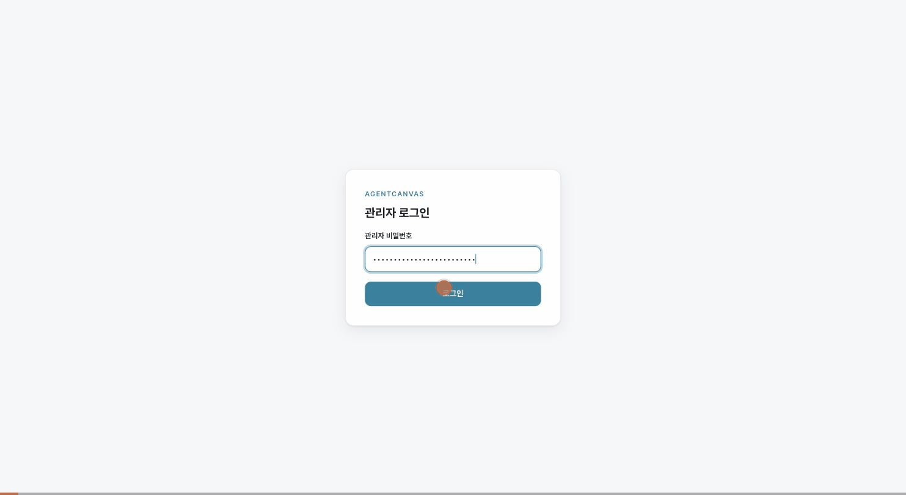
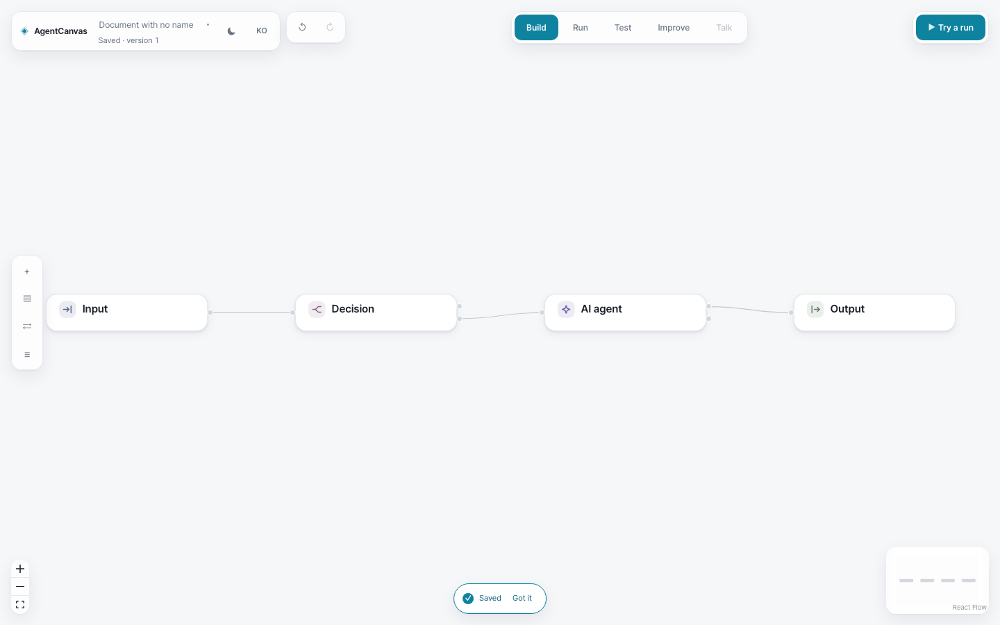
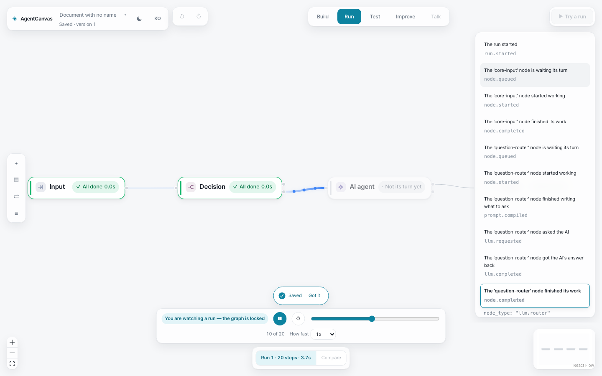
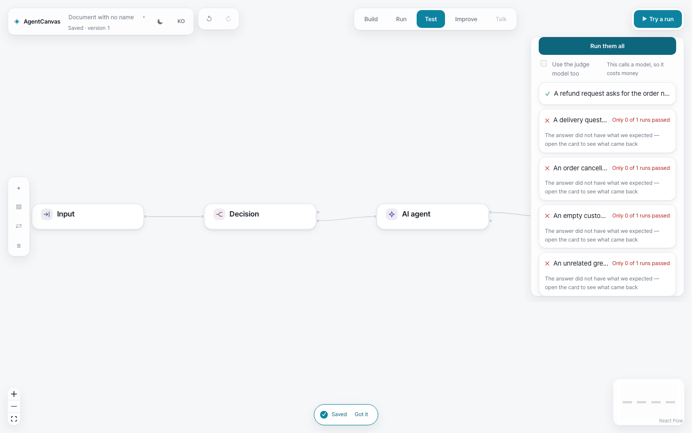
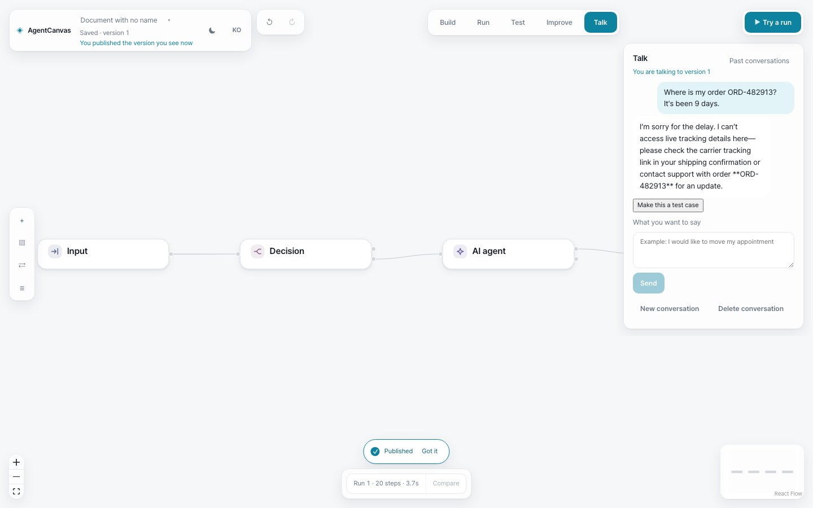

# AgentCanvas

**AI 에이전트를 캔버스에 그리고, 도는 모습을 보고, 믿을 만해질 때까지 시험합니다 — 전부 내 컴퓨터 안에서.**

[English](README.md) | **한국어**

[](https://github.com/yunho-ju/agentcanvas/actions/workflows/ci.yml)
[](LICENSE)
[](CHANGELOG.md)



AgentCanvas는 내 서버에 직접 올려 쓰는(셀프호스트) AI 에이전트 제작 도구입니다. 자기 일은 잘 알지만 코드는 쓰지 않는 사람을 위해 만들었습니다. 에이전트가 무엇을 해야 하는지 말로 적으면 AI 설계 도우미(AI Architect)가 그래프 초안을 만들고, 그다음부터는 모든 단계가 눈에 보입니다. 각 노드에 무엇을 시켰는지, 모델이 뭐라고 답했는지, 어떤 시험 케이스가 통과했는지, 다음에 무엇을 고쳐야 하는지까지 전부 화면에 있습니다. 캔버스의 그래프는 에이전트를 그린 그림이 아닙니다. 그래프가 곧 에이전트입니다 — `AgentSpec`이라는 판 번호가 붙은 계약이고, 실행기는 그린 그대로 실행합니다.

> **시작하기 전에.** LLM(대형 언어 모델) API 키가 하나 필요합니다. AI 설계 도우미(AI Architect)와 고치기(Improve), 도구 감싸기는 OpenAI를 쓰며 `AGENTCANVAS_SECRET_OPENAI_API_KEY`와 `AGENTCANVAS_OPENAI_MODEL`이 **둘 다** 있어야 합니다. 실행과 시험은 Anthropic이나 OpenAI 호환 endpoint도 쓸 수 있습니다. 키를 하나도 설정하지 않아도 앱은 켜지지만, 실행은 정해진 대체 답변으로만 답하고 설계 도우미는 쓸 수 없습니다.
>
> **아직 alpha 단계의 소프트웨어입니다** — 첫 alpha(`v0.1.0-alpha.1`)를 준비하는 중이고 아직 태그하지 않았습니다. 신뢰할 수 있는 관리자 한 명이 작업 공간 하나를 쓰는 것을 전제로 만들었고, 소스 형태로만 배포하며(미리 빌드한 이미지나 패키지는 아직 없습니다), HTTP API와 환경 변수, 화면은 alpha 판 사이에서 바뀔 수 있습니다. 무엇이 바뀌었고 무엇이 아직 안 되는지는 [`CHANGELOG.md`](CHANGELOG.md)에 있습니다.

## 가장 빠른 시작

Docker와 Compose v2가 필요합니다.

```bash
git clone https://github.com/yunho-ju/agentcanvas.git && cd agentcanvas
(umask 077; cp .env.example .env)
```

`.env`를 열어 세 가지를 채웁니다. `AGENTCANVAS_ADMIN_PASSWORD`(12자 이상), `AGENTCANVAS_SESSION_SECRET`(32자 이상 — `python -c 'import secrets; print(secrets.token_urlsafe(48))'`로 하나 만들 수 있습니다), 그리고 OpenAI 키와 모델 ID입니다. 그다음:

```bash
docker compose up --build -d
```

<http://localhost:8080>을 열고 관리자 비밀번호로 로그인한 뒤, 에이전트에게 시키고 싶은 일을 적으면 됩니다. 끄려면 `docker compose down`을 씁니다. `-v`는 저장된 것을 전부 지울 때만 붙이세요 — 그래프, 실행, 시험, 대화 기록, 그리고 마이그레이션 백업까지 사라집니다.

소스에서 바로 돌리고 싶다면 [로컬 개발](#로컬-개발)을 참고하세요.

## 할 수 있는 일

캔버스 하나 위에 다섯 개의 모드가 있습니다. 그래프를 떠날 일이 없습니다.

| | |
|---|---|
| **만들기(Build)** — 설계 도우미에게 초안을 부탁하거나, 직접 노드를 끌어다 놓습니다. 모든 노드가 아직 무엇을 봐야 하는지 알려 줍니다.  | **실행(Run)** — 실행을 시작하고, 타임라인을 한 단계씩 보고, 멈췄다가 앞뒤로 훑고, 사람이 결정하는 자리에서 승인하거나 거절합니다.  |
| **시험(Test)** — 모델에게 시험 케이스를 제안받고, 마음에 드는 것만 남겨서 한 번에 돌립니다. 실패한 케이스는 점수만이 아니라 무엇을 고쳐야 하는지를 알려 줍니다.  | **대화(Talk)** — 판을 내놓고, 사용자처럼 말을 걸어 봅니다. 어떤 답이든 한 번 눌러 시험 케이스로 만들 수 있습니다.  |

- **만들기(Build).** 그리는 동안 바로 검사해 주는 노드·연결 편집, 모든 칸을 쉬운 말로 설명하는 속성 창, 되돌리기와 다시 하기, 무언가를 지우기 전에 보여 주는 영향 미리보기, 판 기록, 서버나 파일로 저장.
- **AI 설계 도우미(AI Architect).** 한 문장을 넣으면 검토를 마친 초안이 나옵니다. 캔버스에 닿기 전에 계약 확인, 흐름 확인, 가짜 실행(모델을 부르지 않는 모의 실행)이 먼저 돌고, 초안의 각 단계는 이미 이 서버가 부를 수 있는 모델을 지목하고 있습니다.
- **실행(Run).** 경로를 따라가는 실행과 실시간 이벤트 흐름(흐름이 끊기면 읽던 자리부터 한 번 이어 받습니다), 사람이 승인하는 자리, 취소, 실행 기록, 두 실행의 나란히 비교.
- **시험(Test).** 케이스를 모아 둔 묶음, AI가 제안하는 케이스(도구를 압니다 — 제안은 이 그래프가 어떤 도구를 부를 수 있는지 알고 만들어집니다), 필요한 통과 횟수를 정해 두고 여러 번 돌리기, 묶음 실행 기록과 비교. 판정은 사다리처럼 올라갑니다. 먼저 정확한 문구, 다음은 내 컴퓨터에서 도는 뜻 비교, 마지막이 선택 사항인 심판 모델입니다. 아래 칸이 판단하지 못했을 때만 위 칸으로 올라가고, 모든 결과가 어느 칸이 판정했는지 말해 줍니다. 뜻 비교 칸은 `agentcanvas-adapters[nli]` 추가 묶음이 필요해서 소스에서 직접 돌릴 때만 쓸 수 있고, Docker 이미지에는 들어 있지 않습니다.
- **고치기(Improve).** 무엇이 더 나아져야 하는지 말하면, 모델이 그래프를 어떻게 바꿀지 제안합니다 — 시험 결과가 있으면 그 결과에 근거해서 제안합니다. 설계 도우미 초안과 똑같이 확인하고 적용하면 됩니다.
- **대화(Talk).** 판을 내놓고, 내놓은 판과 대화하고, 지난 대화를 다시 열어 보고, 그 대화에서 뽑아낸 고칠 만한 지점을 봅니다.
- **사실대로 말하는 모델 선택기.** 이 서버가 실제로 부를 수 있는 모델이 맨 앞에 옵니다. 나머지도 보이기는 하지만 고를 수 없는 상태로, 그 이유와 함께 남아 있습니다.

## 왜 이렇게 만들었는가

- **계약이 원본입니다.** 화면과 엔진, API는 모두 `AgentSpec`과 `RunEvent`를 비춘 것입니다. 계약에 없는 뜻이 화면에 생기지 않습니다.
- **쉬운 말, 설명 없는 용어는 없습니다.** 자기 일을 아는 사람이라면 화면을 본 지 몇 초 안에 무엇을 할지 알아야 하고, 실수가 무서운 일이 되어서는 안 됩니다. 막을 때는 손이 있는 자리에서 이유를 말하고, 되돌리기로 돌아올 수 있습니다.
- **정직한 평가.** 초록색 표시가 품질의 증거는 아닙니다. 시험은 문구 포함, 뜻, 또는 심판 모델로 판정하며, 화면은 항상 어느 층이 판정했는지와 실제 답이 무엇이었는지를 말합니다.
- **내가 돌립니다.** 컨테이너 두 개, SQLite 파일 하나, 검증된 백업과 함께 앞으로만 진행하는 마이그레이션. 계정도, 사용 정보 수집도 없고, 직접 고른 모델 제공자 말고는 클라우드에 기대지 않습니다.

## 지금 상태

지금 되는 것: 위 *할 수 있는 일*의 모든 내용. 관리자 한 명이 비밀번호로 들어오고 그 밖의 요청은 거절됩니다. 실행과 시험 대기열은 서버를 다시 켜도 살아남습니다. Docker Compose 배포도 됩니다.

아직 안 되는 것: 여러 사용자, 역할, 함께 쓰는 작업 공간. 한 단계마다 모델 제공자를 정확히 한 번만 부른다는 보장. 서버를 여러 대로 늘리기, PostgreSQL, Kubernetes. 정해진 형식의 로그, 지표, 호출 횟수 제한, 다른 기계로의 백업. 진짜 MCP 실행기, 내놓기/되돌리기 절차와 [`docs/vision/`](docs/vision/)에 있는 그 밖의 구상들(그중 일부는 이미 나왔고, 그렇게 표시해 두었습니다). 미리 빌드한 이미지와 패키지는 그 안에 무엇이 들었는지 적은 목록과 체크섬, 온전한 라이선스 묶음을 함께 낼 수 있게 되면 뒤따를 예정입니다.

## 구성

| 변수 | 기본값 | 의미 |
|---|---|---|
| `AGENTCANVAS_ADMIN_PASSWORD` | 필수 | 단일 관리자 비밀번호(12자 이상) |
| `AGENTCANVAS_SESSION_SECRET` | 필수 | 별도의 HMAC session secret(32 UTF-8 바이트 이상) |
| `AGENTCANVAS_SECRET_OPENAI_API_KEY` | 비어 있음 | OpenAI 키. 아래 모델 ID와 함께 있어야 설계 도우미와 고치기, 도구 감싸기가 켜집니다 |
| `AGENTCANVAS_OPENAI_MODEL` | 비어 있음 | 쓸 OpenAI 모델 ID. AgentCanvas가 대신 골라 주지 않습니다. 이 값과 키가 둘 다 있어야 합니다 |
| `AGENTCANVAS_SECRET_ANTHROPIC_API_KEY` | 비어 있음 | 실행과 시험에서 기본 제공되는 Anthropic 모델을 켭니다 |
| `AGENTCANVAS_LOCAL_MODEL` / `AGENTCANVAS_LOCAL_BASE_URL` | 비어 있음 / `http://host.docker.internal:11434/v1` | OpenAI 호환 로컬 endpoint(Ollama, vLLM 등) |
| `AGENTCANVAS_JUDGE_MODEL` | `model://default`(Anthropic) | 시험 모드의 선택 사항인 심판 칸이 부를 모델. OpenAI 키만 있는 서버라면 `model://openai`로 지정하세요. 그렇지 않으면 심판은 제안되지 않습니다 |
| `AGENTCANVAS_BIND` / `AGENTCANVAS_PORT` | `127.0.0.1` / `8080` | Studio를 여는 위치 |
| `AGENTCANVAS_ALLOWED_ORIGINS` | `http://localhost:8080`(Compose 기본값) | API를 부를 수 있는 브라우저 origin(출처)을 정확히 적은 목록. `*`는 거부됩니다. 소스에서 직접 돌릴 때의 기본값은 로컬 Studio 개발 서버만 허용합니다 |
| `AGENTCANVAS_SESSION_TTL_SECONDS` | `28800` | 고정된 session 만료 시간(60초 ~ 7일) |
| `AGENTCANVAS_COOKIE_SECURE` | `false` | HTTPS 뒤에서는 반드시 `true` |
| `AGENTCANVAS_DB` | `/data/agentcanvas.db` | SQLite 경로 |
| `AGENTCANVAS_BACKUP_RETENTION` | `10` | 마이그레이션 백업을 몇 개까지 보관할지. Compose에서는 `/backups` 볼륨에, 소스에서 직접 돌릴 때는 데이터베이스 옆 `backups/`에 쌓입니다 |
| `VITE_API_URL` | `/api` | 빌드할 때 Studio 번들에 새겨지는 API URL — 바꾼 뒤에는 다시 빌드해야 합니다 |

키는 `.env`에만 두세요. 이 파일은 git이 무시하며, 서버는 키를 브라우저로 보내지 않습니다.

## 보안과 데이터

상태 확인(health)과 로그인을 뺀 모든 요청은 서명된 session cookie가 없으면 거절됩니다. 무언가를 바꾸는 요청은 `X-CSRF-Token` 헤더까지 함께 가져와야 합니다(다른 웹사이트가 내 이름으로 행동하지 못하게 막는 장치입니다). 기본 설정은 loopback HTTP이므로, 원격에 배포한다면 TLS나 reverse proxy를 앞에 두고 `AGENTCANVAS_COOKIE_SECURE=true`를 설정해야 합니다. 내장된 TLS, OIDC, 다단계 인증은 없습니다. 자세한 내용: [`docs/security/authentication.md`](docs/security/authentication.md).

데이터베이스와 마이그레이션 백업은 Compose volume 두 개에 들어갑니다. 마이그레이션은 앞으로만 진행합니다. 이미 데이터가 있는 데이터베이스라면 무엇이든 바꾸기 전에 백업을 뜨고 검증하며, 알 수 없는 schema는 추측해서 고치지 않고 시작을 중단합니다. 자세한 내용: [`docs/operations/durability.md`](docs/operations/durability.md), [`docs/operations/backup-and-restore.md`](docs/operations/backup-and-restore.md), [`docs/operations/deployment.md`](docs/operations/deployment.md).

## 로컬 개발

Python 3.12+, uv 0.8.15, Node.js 22.20+, pnpm 10.15.1이 필요합니다.

```bash
uv sync --frozen && pnpm install --frozen-lockfile
export AGENTCANVAS_ADMIN_PASSWORD='local-development-admin-password'
export AGENTCANVAS_SESSION_SECRET="$(python -c 'import secrets; print(secrets.token_urlsafe(48))')"
uv run --frozen uvicorn agentcanvas_api.app:serves --factory --reload   # API on :8000
pnpm dev                                                                # Studio on :5173, in another terminal
```

Studio는 `http://localhost:5173`에서 엽니다(`127.0.0.1`이 아니라 `localhost`를 쓰세요 — session cookie가 거기에 묶여 있습니다). API 데이터베이스는 저장소 최상위의 `agentcanvas.db`가 기본값입니다. 실험을 서로 떼어 놓으려면 `AGENTCANVAS_DB`를 지정하세요.

CI가 돌리는 것과 같은 검사입니다.

```bash
uv run --frozen ruff check packages && uv run --frozen ruff format --check packages
uv run --frozen pytest
pnpm test && VITE_API_URL=/api pnpm build
pnpm gen:types && git diff --exit-code -- apps/studio/src/generated
```

## 저장소 구조

의존 방향은 한쪽입니다. `contracts ← engine ← adapters ← apps`.

- `packages/contracts` — `AgentSpec`, `RunEvent`, 평가·설계 도우미·대화·릴리스 계약과 거기서 생성한 JSON Schema
- `packages/engine` — 그래프 검증, 경로를 따라가는 실행기, 평가 사다리
- `packages/adapters` — 모델 제공자 경계(Anthropic, OpenAI 호환), 설계 도우미와 케이스 제안 프롬프트, 도구 호출
- `packages/api` — FastAPI, 인증, SQLite 저장소, SSE, 재시작에도 살아남는 작업자
- `apps/studio` — React/TypeScript로 만든 Studio
- `examples/` — 판 번호가 붙은 계약 예시 · `docs/` — [디자인 언어](docs/design/design-language.md), 구속력 있는 [UI 명세](DESIGN.md), [제품 범위](PRODUCT.md), [아키텍처](docs/AGENTCANVAS_DESIGN.md), [운영](docs/operations/), [보안](docs/security/), [비전](docs/vision/)(제안이며, 지금 되는 기능이 아닙니다)

## 커뮤니티와 기여

질문과 아이디어는 [GitHub Discussions](https://github.com/yunho-ju/agentcanvas/discussions)에, 결함은 [이슈 템플릿](https://github.com/yunho-ju/agentcanvas/issues/new/choose)으로 보내 주세요. Pull request도 환영합니다 — 먼저 [`CONTRIBUTING.md`](CONTRIBUTING.md)를 읽어 주세요. 모든 커밋에는 DCO 서명(`git commit -s`)이 필요하고, CI가 이를 확인합니다. 보안 신고는 [`SECURITY.md`](SECURITY.md)를 따르고, 프로젝트의 결정 규칙은 [`GOVERNANCE.md`](GOVERNANCE.md)에 있습니다.

## 라이선스

Apache License 2.0 — [`LICENSE`](LICENSE)를 보세요. 제3자 고지는 [`THIRD_PARTY_NOTICES.md`](THIRD_PARTY_NOTICES.md)에 있습니다.
